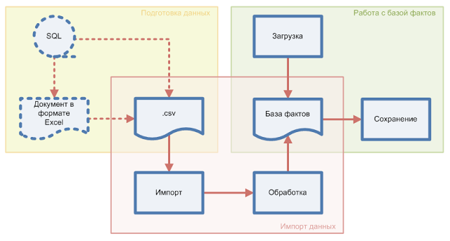

# FactBaseProlog

**Желтая** — подготовка промежуточного файла. Для простого импорта это может быть просто сохранение документа в формате CSV.

Для работы по регламенту возможна настройка компонентов БД (например MS SQL Server Integration Services) для периодической выгрузки.

**Красная** — импорт данных из CSV файла в базу фактов.

**Зеленая** — работа с базой фактов в Прологе.

Примечание. Стрелками показаны потоки данных.

# Протокол работы
4 ?- import_base.
true.

5 ?- forall(base1(N1,N2,N3),writeln(base1(N1,N2,N3))).
base1(Петров Петр, 12, Лансер)
base1(Сидоров Александр, 13, Ниссан)
base1(Тимофеев Игорь, 14, Лансер)
true.

6 ?- save_base.
true.

7 ?- abolish(base1/3).
true.

8 ?- forall(base1(N1,N2,N3),writeln(base1(N1,N2,N3))).
ERROR: toplevel: Undefined procedure: base1/3 (DWIM could not correct goal)

9 ?- load_base.
% c:/pl/prj1/file1.pl compiled 0.00 sec, 492 bytes
true.

10 ?- forall(base1(N1,N2,N3),writeln(base1(N1,N2,N3))).
base1(Петров Петр, 12, Лансер)
base1(Сидоров Александр, 13, Ниссан)
base1(Тимофеев Игорь, 14, Лансер)
true.